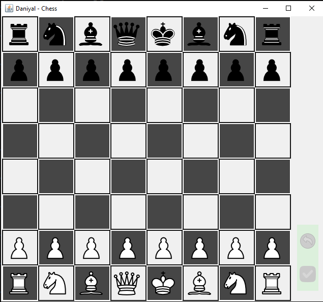
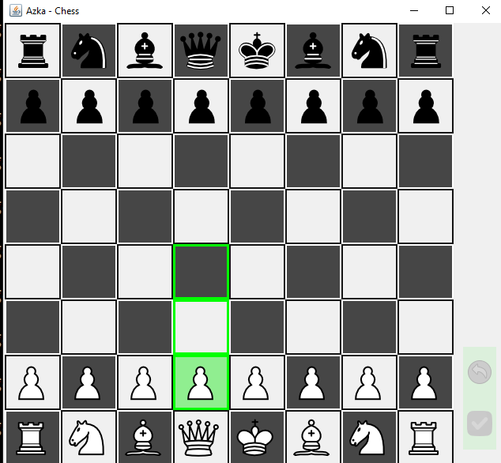
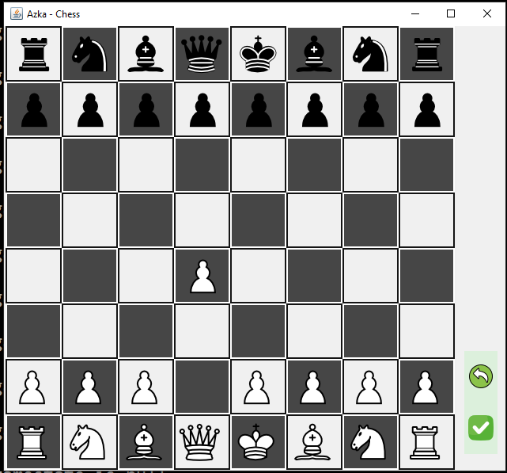
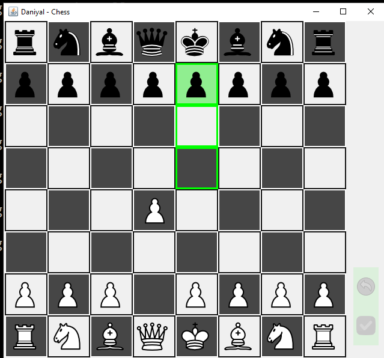
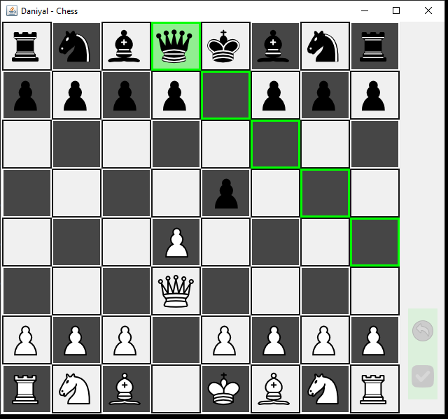
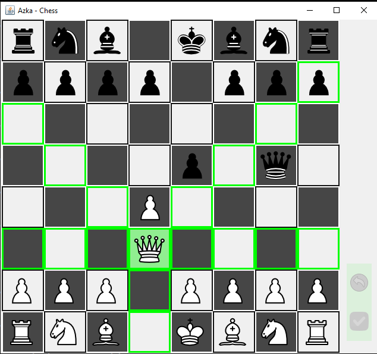

# **Java Swing Chess Application**

## **Overview**
This project is a fully functional chess game developed using **Java Swing**. It features robust gameplay mechanics and advanced functionalities such as checkmate detection, castling, undo moves, and more. The application supports both **local play** and **networked multiplayer mode** using a custom-built networking framework.

---

## **Features**

### **Core Features**
- **Standard Chess Rules**: Implements all standard chess rules, including piece movement, check, and checkmate.
- **Highlight Valid Tiles**: Displays valid moves for the selected piece.

### **Advanced Features**
- **Checkmate Detection**: Automatically determines when a game ends in checkmate.
- **Castling**: Fully functional with proper validation.
- **No Self-Check Rule**: Ensures no move leaves the king in check.
- **Undo Functionality**: Allows players to revert their moves.
- **Pawn Promotion**: Players can choose the promotion piece via a custom dialog.

### **Networking Support**
- **Custom Networking Framework**: Enables two players to connect over a network and play seamlessly.
- **Dynamic Matchmaking**: Matches players based on connection order using UUIDs.
- **Real-Time Updates**: Synchronizes moves between clients.
- **Disconnect Handling**: Manages client disconnections gracefully.

---

## **Project Structure**

```
chess-main/
├── src/               # Source code for the chess game
│   ├── validators/    # Classes for validating moves for each chess piece
│   ├── networking/    # Server and client classes for multiplayer functionality
│   ├── models/        # Data Transfer Objects (DTOs) for managing game data
│   ├── gui/           # GUI components for the chessboard and game windows
├── resources/         # Media files (images, screenshots, and videos)
├── README.md          # Documentation
```

---

## **Requirements**
- **Java Development Kit (JDK)**: Version 8 or higher.
- **Gson Library**: Required for serialization and deserialization.
- **Networking Framework**: Clone and build the [NFrameworkserver](https://github.com/Mohammeddaniyal/NetworkFramework.git).

---

## **Setup and Usage**

### **Step 1: Clone the Repository**
```bash
git clone https://github.com/YourUsername/Chess.git
cd Chess
```

### **Step 2: Compile the Code**

#### **For Server**
```bash
javac -classpath path/to/server.jar:path/to/common.jar:path/to/gson.jar src/networking/ServerChessFrame.java src/networking/ServerChessUpdater.java
```

#### **For Client**
```bash
javac -classpath path/to/client.jar:path/to/common.jar:path/to/gson.jar src/gui/Chess.java src/gui/ChessStartWindow.java
```

### **Step 3: Run the Application**

#### **Start the Server**
```bash
java -classpath path/to/server.jar:path/to/common.jar:path/to/gson.jar src.networking.ServerChessFrame
```

#### **Start the Client**
```bash
java -classpath path/to/client.jar:path/to/common.jar:path/to/gson.jar src.gui.Chess "username" "password"
```

---

## **Gameplay Screenshots**







---

## **Gameplay Video**
<iframe src="https://drive.google.com/file/d/1WvdTe5DRsjf_34TPDAAonZoLQbTWYnUe/view?usp=drive_link" width=640" height="480" allow="autoplay"></iframe>


---


## **Contributions**
Contributions are welcome! If you'd like to contribute, please fork the repository, make changes, and submit a pull request.

---

## **License**
This project is licensed under the MIT License. See the `LICENSE` file for details.

---

## **Acknowledgments**
Special thanks to everyone who contributed to the development of this project.
